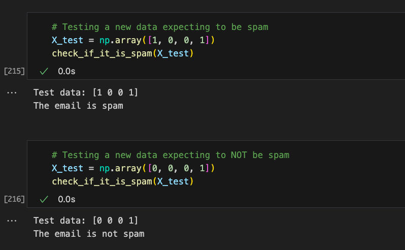

# setrem-perceptron-demo

## Introduction
In this repo we have an example of the Perceptron IA algorithm to classify an email as spam.

The [spam.ipynb](./spam.ipynb) notebook shows the implementation of this algorithm.

## Dataset
In the dataset [spam_dataset.csv](./spam_dataset.csv) we are defining four features:
- Frequency of keywords related with spam: 1 for high and 0 for low.
- It has attachments: 1 for yes and 0 for no.
- Number of external links in the body: if > 3 then 1, otherwise 0.
- If the sender is knows it takes 1 otherwise it takes 0.

## Training the algorithm
Using the [spam_dataset.csv](./spam_dataset.csv) dataset and running up to 10 epochs, it tooks eight epochs to the acurrancy to be 100%.

In this model, using a learning rate of 0.4 and the weights starting with zero, the final weights and bias were:
```
Weights: [ 0.8  1.6 -1.6 -1.6]
Bias: 1.6
```

## Predicting with new values

After the training to be finished, I could simulate the prediction of two values:
```
1, 0, 0, 1
```
... and
```
0, 0, 0, 1
```

The result was:



